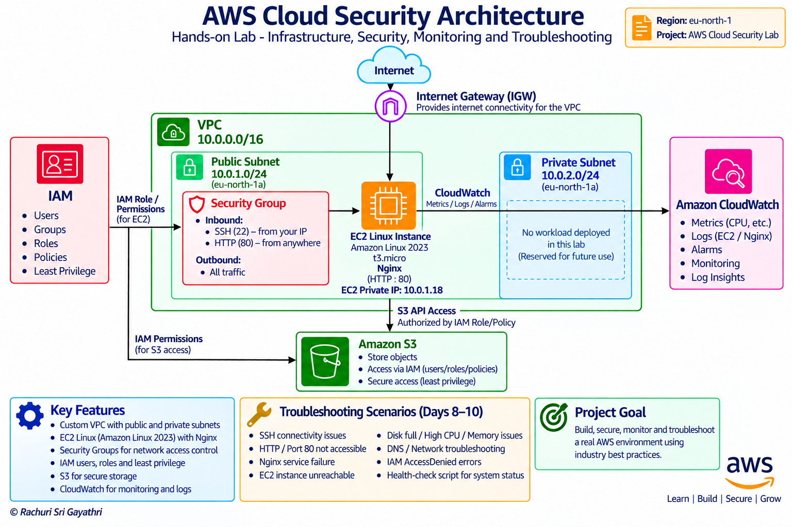

# AWS Cloud Security Lab

## Overview

This project is a hands-on **AWS Cloud Security and Cloud Support laboratory** designed to develop practical skills in cloud infrastructure, Linux administration, networking, identity and access management, storage, monitoring, security, and troubleshooting.

The project was completed through a structured **11-day practical lab** covering:

- AWS networking
- Amazon EC2
- Amazon Linux 2023
- Nginx
- IAM
- Amazon S3
- Amazon CloudWatch
- Linux administration
- Network and service troubleshooting
- IAM permission troubleshooting
- Basic Bash health-check automation
- Technical documentation

The goal was to build practical skills relevant to entry-level cloud and infrastructure roles such as:

- Cloud Support Engineer
- Cloud Support Associate
- Cloud Operations Engineer
- Junior Cloud Engineer
- Junior Cloud Security Engineer
- Linux Support Engineer
- Technical Support Engineer

> **Note:** The troubleshooting scenarios in this project were controlled lab exercises designed to simulate common cloud support, Linux administration, networking, and security problems.

---

# Project Architecture

```
                              AWS Cloud
                                  |
                              Internet
                                  |
                         Internet Gateway
                                  |
                                  v
                         +----------------+
                         |      VPC       |
                         |  10.0.0.0/16   |
                         +----------------+
                            |          |
                            |          |
                            v          v
                    +-----------+  +-----------+
                    |  Public   |  |  Private  |
                    |  Subnet   |  |  Subnet   |
                    |10.0.1.0/24|  |10.0.2.0/24|
                    +-----------+  +-----------+
                          |
                          v
                    +-----------+
                    |    EC2    |
                    | Amazon    |
                    | Linux 2023|
                    +-----------+
                          |
                    Security Group
                     /           \
                    /             \
                 SSH               HTTP
                :22                 :80
                 |                   |
                 v                   v
             Linux                 Nginx
                 |
        +--------+---------+
        |                  |
       IAM                S3
        |                  |
   Access Control     Object Storage
        |
        +----------------------+
                               |
                         CloudWatch
                       Metrics / Logs
                               |
                               v
                    Troubleshooting &
                     Security Monitoring
```

### Architecture Diagram



### Architecture Components

| Component | Purpose |
|---|---|
| AWS Region | `eu-north-1` |
| Amazon VPC | Custom network environment |
| VPC CIDR | `10.0.0.0/16` |
| Public Subnet | `10.0.1.0/24` |
| Private Subnet | `10.0.2.0/24` |
| Internet Gateway | Internet connectivity |
| Route Tables | Network traffic routing |
| Security Group | Controls inbound and outbound traffic |
| Amazon EC2 | Linux cloud server |
| Operating System | Amazon Linux 2023 |
| Nginx | Web server |
| IAM | Identity and access management |
| Amazon S3 | Object storage |
| CloudWatch | Monitoring, logs, and alarms |

> The private subnet was created as part of the network design but no workload was deployed there during this lab. It is reserved for future use.

---

# Technologies and AWS Services

| Technology / Service | Purpose |
|---|---|
| AWS VPC | Network infrastructure |
| Amazon EC2 | Cloud Linux server |
| Amazon Linux 2023 | Server operating system |
| Security Groups | Network access control |
| IAM | Identity and access management |
| Amazon S3 | Object storage |
| Amazon CloudWatch | Monitoring and logging |
| Internet Gateway | Internet connectivity |
| Route Tables | Network traffic routing |
| Nginx | Web server |
| SSH | Secure remote access |
| AWS CLI | AWS service management |
| Linux CLI | Server administration |
| systemd | Linux service management |
| journalctl | Log investigation |
| Bash | Automation and health checks |

---

# Environment

| Configuration | Value |
|---|---|
| AWS Region | `eu-north-1` |
| VPC CIDR | `10.0.0.0/16` |
| Public Subnet | `10.0.1.0/24` |
| Private Subnet | `10.0.2.0/24` |
| Availability Zone | `eu-north-1a` |
| EC2 Instance Type | `t3.micro` |
| Operating System | Amazon Linux 2023 |
| EC2 User | `ec2-user` |
| Web Server | Nginx |
| HTTP Port | `80` |
| SSH Port | `22` |

---

# Project Roadmap

| Day | Topic | Main Skills |
|---|---|---|
| Day 1 | VPC & Networking | VPC, CIDR, subnets, Internet Gateway, route tables |
| Day 2 | EC2 & Security | EC2, Security Groups, ports, SSH, HTTP, Linux |
| Day 3 | Nginx | Nginx, website, systemd, logs |
| Day 4 | IAM | Users, groups, roles, policies, least privilege |
| Day 5 | S3 | Buckets, objects, AWS CLI, IAM → S3 access |
| Day 6 | CloudWatch | Metrics, logs, alarms, monitoring |
| Day 7 | Troubleshooting #1 | SSH, port 80, website connectivity |
| Day 8 | Troubleshooting #2 | Nginx, service recovery, HTTP connectivity |
| Day 9 | Troubleshooting #3 | Disk, CPU, memory |
| Day 10 | Troubleshooting #4 | Network, DNS, IAM AccessDenied, health check |
| Day 11 | Portfolio | README, architecture, incident reports, screenshots, GitHub cleanup |

---

# Day 1 — VPC and Networking

## Topics Covered

- VPC creation
- CIDR notation
- Public subnet
- Private subnet
- Internet Gateway
- Route tables
- Public route configuration
- Subnet associations
- Basic AWS networking

## Tasks Completed

The VPC networking environment was created and configured.

The lab included:

- Creating a VPC
- Defining the VPC CIDR range
- Creating a public subnet
- Creating a private subnet
- Creating an Internet Gateway
- Attaching the Internet Gateway to the VPC
- Creating route tables
- Configuring routes
- Associating the public subnet with the appropriate route table

## Network Design

```
VPC
10.0.0.0/16
     |
     +-------------------------+
     |                         |
     v                         v
Public Subnet             Private Subnet
10.0.1.0/24               10.0.2.0/24
     |                         |
     v                         |
EC2 Linux              Reserved for future use
     |
Internet Gateway
```

## Skills Demonstrated

- AWS VPC fundamentals
- CIDR understanding
- Subnetting
- Route tables
- Internet Gateway
- Public vs private network design
- Basic network troubleshooting

### Evidence

[View Day 1 screenshots](screenshots/day01-vpc/)

---

# Day 2 — EC2, Security Groups and Linux

## Topics Covered

- EC2 instance deployment
- Security Groups
- Network ports
- SSH access
- HTTP access
- Linux basics
- Users and permissions
- Package management
- System monitoring

## EC2 Environment

The EC2 instance used:

- Amazon Linux 2023
- `t3.micro`
- `ec2-user`
- Public subnet
- Security Group
- SSH access
- HTTP access

## Important Ports

| Port | Protocol | Purpose |
|---|---|---|
| 22 | SSH | Remote Linux administration |
| 80 | HTTP | Web traffic |
| 443 | HTTPS | Secure web traffic |

## SSH

Example:

```
ssh -i "<private-key>" ec2-user@<PUBLIC-IP>
```

> Private keys, passwords, access keys, and other credentials were not included in the repository.

## Linux Practice

Commands and tools included:

```
whoami
pwd
ls
ls -l
chmod
chown
dnf
htop
df -h
free -h
top
```

## Skills Demonstrated

- EC2 deployment
- Linux server access
- SSH
- Security Groups
- Port-based network access
- Linux administration
- Basic system monitoring

### Evidence

[View Day 2 screenshots](screenshots/day02-ec2-security/)

---

# Day 3 — Nginx Web Server

## Topics Covered

- Nginx installation
- Web server configuration
- Website testing
- systemd
- Service management
- Log investigation
- HTTP connectivity

Nginx was installed and managed on the Amazon Linux 2023 EC2 server.

## Installation

```
sudo dnf install nginx -y
```

## Service Verification

```
sudo systemctl status nginx
```

## Service Management

```
sudo systemctl start nginx
sudo systemctl stop nginx
sudo systemctl restart nginx
sudo systemctl status nginx
```

## HTTP Testing

```
curl -I http://localhost
```

The Nginx service was tested locally and verified through HTTP responses.

## Skills Demonstrated

- Nginx installation
- Web server configuration
- Linux service management
- systemd
- HTTP testing
- Service troubleshooting
- Log investigation

### Evidence

[View Day 3 screenshots](screenshots/day03-nginx/)

---

# Day 4 — IAM and Least Privilege

## Topics Covered

- IAM users
- IAM groups
- IAM roles
- IAM policies
- Policy JSON
- EC2 permissions
- Role attachment
- Trust policies
- Least privilege
- Access control

IAM was used to understand how AWS controls access to resources.

## Access Model

```
IAM User
   |
   +-- Group
   |     |
   |     +-- IAM Policy
   |
   +-- Permissions


EC2
 |
 +-- IAM Role
       |
       +-- IAM Policy
```

A restricted EC2 read-only policy was created and tested.

The lab also demonstrated the relationship between:

- IAM identities
- Policies
- Roles
- Resources
- Permissions

## Security Principle

The **least-privilege principle** means that users and services should receive only the permissions required to perform their intended tasks.

## Skills Demonstrated

- AWS IAM
- Identity management
- Access control
- IAM policies
- IAM roles
- Trust policies
- Permission analysis
- Least privilege

### Evidence

[View Day 4 screenshots](screenshots/day04-iam/)

---

# Day 5 — Amazon S3 and IAM Access

## Topics Covered

- S3 bucket creation
- S3 objects
- AWS CLI
- IAM policies
- Bucket access
- Access-denied testing
- Permission verification

An S3 bucket was created and used to practice object storage and IAM-controlled access.

The lab demonstrated both successful and denied operations to understand how IAM permissions affect access to S3 resources.

## AWS CLI

Caller identity was checked before testing permissions:

```
aws sts get-caller-identity
```

S3 commands included:

```
aws s3 ls
```

```
aws s3 ls s3://<bucket-name>
```

```
aws s3 cp <file> s3://<bucket-name>/
```

## IAM Permission Testing

The lab demonstrated that:

- Some S3 operations could be denied
- Access to a specific bucket could still be allowed
- IAM policy scope affects the result of AWS CLI operations

## Skills Demonstrated

- Amazon S3
- Object storage
- AWS CLI
- IAM permissions
- Bucket access
- AccessDenied troubleshooting

### Evidence

[View Day 5 screenshots](screenshots/day05-s3/)

---

# Day 6 — CloudWatch Monitoring

## Topics Covered

- EC2 CPU metrics
- CloudWatch alarms
- CloudWatch Logs
- Log events
- Logs Insights
- Monitoring
- Basic alerting

Amazon CloudWatch was used to understand basic AWS monitoring and operational visibility.

## Monitoring Flow

```
EC2
 |
 +---- CPU Metrics
 |
 +---- CloudWatch Alarm
 |
 +---- CloudWatch Logs
          |
          +---- Logs Insights
```

A CPU alarm was created and reviewed.

CloudWatch Logs and log events were also investigated.

## Skills Demonstrated

- AWS monitoring
- CloudWatch metrics
- CloudWatch alarms
- CloudWatch Logs
- Logs Insights
- Basic alerting
- Operational monitoring

### Evidence

[View Day 6 screenshots](screenshots/day06-cloudwatch/)

---

# Day 7 — Troubleshooting #1

## Scenario

### SSH Failure + Port 80 + Website Not Loading

This controlled troubleshooting exercise simulated common connectivity problems.

## Problems Investigated

- SSH connectivity
- Port 22
- Security Group configuration
- HTTP port 80
- Localhost connectivity
- Nginx availability
- External website connectivity

## Troubleshooting Process

```text
Client
  |
  v
Network Connectivity
  |
  v
Security Group
  |
  v
Port 22 / Port 80
  |
  v
Linux Service
  |
  v
Website
```

The issue was investigated step-by-step instead of changing multiple settings randomly.

## Skills Demonstrated

- Structured troubleshooting
- SSH troubleshooting
- HTTP troubleshooting
- Security Group analysis
- Network diagnosis
- Connectivity testing
- Root-cause analysis

### Evidence

[View Day 7 screenshots](screenshots/day07-troubleshooting/)

### Incident Report

[Incident 01 — SSH and HTTP Connectivity](incident-reports/incident-01-ssh-http.md)

---

# Day 8 — Troubleshooting #2

## Scenario

### Nginx Failure + Service Problems

This controlled troubleshooting exercise focused on diagnosing a failed web service and validating recovery.

## Problems Investigated

- Nginx service state
- Port 80
- Security Group configuration
- Localhost HTTP response
- External HTTP connectivity
- Service recovery

## Important Commands

```
sudo systemctl status nginx
```

```
sudo systemctl restart nginx
```

```
curl -I http://localhost
```

```
ss -tulpn
```

## Troubleshooting Process

```text
Check Instance
      |
      v
Check Connectivity
      |
      v
Check Nginx Status
      |
      v
Check Port 80
      |
      v
Test Localhost
      |
      v
Test External HTTP
      |
      v
Restore Service
      |
      v
Verify Recovery
```

## Skills Demonstrated

- Nginx troubleshooting
- systemd troubleshooting
- Linux service recovery
- HTTP troubleshooting
- Port investigation
- Cloud server troubleshooting

### Evidence

[View Day 8 screenshots](screenshots/day08-nginx-troubleshooting/)

### Incident Report

[Incident 02 — Nginx Service Failure](incident-reports/incident-02-nginx.md)

---

# Day 9 — Troubleshooting #3

## Scenario

### Disk Full + High CPU + Memory Issue

Three common Linux resource problems were investigated through controlled tests.

## Disk Troubleshooting

Disk usage was checked using:

```
df -h
```

Excessive test data was created under `/var/tmp` to simulate increased disk usage.

The source of the increased usage was identified, and the test data was removed.

Disk usage was then verified again.

## CPU Troubleshooting

CPU utilisation was investigated using:

```bash
top
```

A controlled CPU-intensive process was used to simulate high CPU usage.

The process was identified and terminated.

CPU utilisation was then checked again.

## Memory Troubleshooting

Memory usage was checked using:

```bash
free -h
```

A controlled memory workload was used to simulate increased memory usage.

Memory availability was checked again after the workload ended.

## Troubleshooting Model

```text
Resource Problem
      |
      +-- Disk
      |
      +-- CPU
      |
      +-- Memory
      |
      v
Identify
   |
Investigate
   |
Remediate
   |
Verify
```

## Skills Demonstrated

- Linux resource monitoring
- Disk troubleshooting
- CPU troubleshooting
- Memory troubleshooting
- Process investigation
- Resource recovery
- System verification

### Evidence

[View Day 9 screenshots](screenshots/day09-resource-troubleshooting/)

### Incident Report

[Incident 03 — Resource Issues](incident-reports/incident-03-resource-issues.md)

---

# Day 10 — Troubleshooting #4

## Scenario

### Network / DNS + IAM AccessDenied + Health Check

This exercise combined infrastructure troubleshooting with AWS security troubleshooting.

---

## Part 1 — Network and DNS

The following areas were investigated:

- Network configuration
- IP addressing
- Default route
- DNS resolution
- Network connectivity
- HTTPS connectivity

Commands included:

```
ip addr
```

```
ip route
```

```
getent hosts amazon.com
```

```
curl -I https://amazon.com
```

```
curl -I https://google.com
```

The exercise also demonstrated that ICMP/ping results should be interpreted separately from DNS and HTTPS connectivity.

---

## Part 2 — IAM AccessDenied

An AWS CLI operation returned an `AccessDenied` error.

The investigation included:

1. Caller identity
2. IAM role
3. IAM policy
4. Required permissions
5. Resource scope
6. S3 permissions

Caller identity was verified using:

```
aws sts get-caller-identity
```

The IAM policy was inspected to understand why access to one operation was denied while access to a specific S3 bucket was permitted.

This demonstrated the importance of understanding **permission scope** rather than simply granting broad permissions.

---

## Part 3 — Health Check Script

A basic Bash health-check script was created to provide a quick operational view of the EC2 environment.

The script checks:

- Hostname
- Disk usage
- Memory usage
- CPU load
- Nginx status
- Network route

Example checks:

```
hostname
```

```
df -h /
```

```
free -h
```

```
uptime
```

```
systemctl is-active nginx
```

```
ip route
```

## Skills Demonstrated

- Network troubleshooting
- DNS troubleshooting
- Routing investigation
- HTTPS connectivity testing
- AWS CLI
- IAM roles
- IAM policies
- S3 permissions
- AccessDenied troubleshooting
- Bash scripting
- Basic automation

### Evidence

[View Day 10 screenshots](screenshots/day10-network-dns-iam/)

### Incident Report

[Incident 04 — Network, DNS and IAM](incident-reports/incident-04-network-dns-iam.md)

---

# Day 11 — Portfolio and Documentation

The final day focused on turning the completed technical lab into a documented GitHub portfolio project.

## Completed

- Project README
- Architecture diagram
- Screenshot organization
- Troubleshooting documentation
- Incident reports
- GitHub repository cleanup
- Final project verification
- Portfolio preparation

## Documentation Structure

```text
AWS-Cloud-Security-Lab/
│
├── README.md
│
├── Architecture/
│   └── aws-cloud-security-architecture.png
│
├── screenshots/
│   ├── day01-vpc/
│   ├── day02-ec2-security/
│   ├── day03-nginx/
│   ├── day04-iam/
│   ├── day05-s3/
│   ├── day06-cloudwatch/
│   ├── day07-troubleshooting/
│   ├── day08-nginx-troubleshooting/
│   ├── day09-resource-troubleshooting/
│   └── day10-network-dns-iam/
│
└── incident-reports/
    ├── incident-01-ssh-http.md
    ├── incident-02-nginx.md
    ├── incident-03-resource-issues.md
    └── incident-04-network-dns-iam.md
```

---

# Troubleshooting Methodology

A major part of this project was learning to troubleshoot systematically instead of making random configuration changes.

The general process used was:

```text
1. Identify the symptom
        ↓
2. Check the current state
        ↓
3. Gather information
        ↓
4. Check network connectivity
        ↓
5. Check security controls
        ↓
6. Check service status
        ↓
7. Check logs
        ↓
8. Identify the root cause
        ↓
9. Apply a controlled fix
        ↓
10. Test again
        ↓
11. Verify the final state
        ↓
12. Document the result
```

This methodology was applied across:

- SSH failures
- HTTP connectivity issues
- Nginx service failures
- Disk usage problems
- CPU problems
- Memory problems
- DNS and network investigations
- IAM AccessDenied errors
- S3 permission problems

---

# Security Concepts Practiced

This project included practical exposure to:

- Least privilege
- IAM policies
- IAM roles
- IAM users and groups
- Security Groups
- Network segmentation
- SSH security
- Access control
- Cloud monitoring
- Security event investigation
- Resource monitoring
- Permission troubleshooting
- IAM policy analysis

---

# Monitoring and Logging

The project used multiple sources of operational information.

## Linux

```bash
systemctl
journalctl
```

Linux tools were used to investigate service status and system events.

## AWS

- Amazon CloudWatch Metrics
- Amazon CloudWatch Logs
- CloudWatch Alarms
- EC2 status
- IAM identity information
- IAM policy information
- AWS CLI results

---

# Troubleshooting Scenarios

| Scenario | Investigation |
|---|---|
| SSH failure | Security Group, port 22, connectivity |
| Website unavailable | Port 80, Security Group, Nginx |
| Nginx failure | systemd, Nginx status, localhost |
| EC2 connectivity problem | Network and security configuration |
| Disk usage problem | Disk usage and unnecessary test data |
| High CPU | Process and resource investigation |
| Memory issue | Memory usage and workload investigation |
| DNS investigation | DNS resolution and HTTPS connectivity |
| IAM AccessDenied | Identity, role, policy and permissions |
| S3 access issue | IAM policy and bucket permissions |
| Health check | Automated environment verification |

---

# Evidence

The repository contains screenshots documenting the practical work completed throughout the project.

## Day 1 — VPC

Evidence includes:

- VPC
- CIDR configuration
- Public subnet
- Private subnet
- Internet Gateway
- Route tables

[View Day 1 screenshots](screenshots/day01-vpc/)

---

## Day 2 — EC2 and Security

Evidence includes:

- EC2 instance
- SSH connection
- Linux administration
- Users and permissions
- Package management
- System monitoring
- Security Group configuration

[View Day 2 screenshots](screenshots/day02-ec2-security/)

---

## Day 3 — Nginx

Evidence includes:

- EC2 connectivity
- Security Group configuration
- Nginx
- HTTP testing
- Service verification
- Troubleshooting evidence

[View Day 3 screenshots](screenshots/day03-nginx/)

---

## Day 4 — IAM

Evidence includes:

- IAM users
- IAM groups
- IAM policies
- Policy JSON
- IAM roles
- Trust policy
- EC2 role attachment
- Permission verification

[View Day 4 screenshots](screenshots/day04-iam/)

---

## Day 5 — S3

Evidence includes:

- S3 bucket
- S3 objects
- AWS CLI
- Caller identity
- IAM policy
- Allowed access
- Denied access

[View Day 5 screenshots](screenshots/day05-s3/)

---

## Day 6 — CloudWatch

Evidence includes:

- EC2 CPU metrics
- CloudWatch alarm
- Alarm configuration
- CloudWatch Logs
- Log events
- Logs Insights

[View Day 6 screenshots](screenshots/day06-cloudwatch/)

---

## Day 7 — Troubleshooting #1

Evidence includes:

- SSH troubleshooting
- Security Group problem
- Connectivity restoration
- HTTP failure
- Port 80 issue
- Website recovery

[View Day 7 screenshots](screenshots/day07-troubleshooting/)

[Incident 01 — SSH and HTTP Connectivity](incident-reports/incident-01-ssh-http.md)

---

## Day 8 — Troubleshooting #2

Evidence includes:

- Nginx failure
- Nginx service recovery
- HTTP testing
- Security Group investigation
- Website restoration

[View Day 8 screenshots](screenshots/day08-nginx-troubleshooting/)

[Incident 02 — Nginx Service Failure](incident-reports/incident-02-nginx.md)

---

## Day 9 — Troubleshooting #3

Evidence includes:

- Disk usage problem
- Disk cleanup
- High CPU
- CPU recovery
- Memory investigation
- Memory recovery

[View Day 9 screenshots](screenshots/day09-resource-troubleshooting/)

[Incident 03 — Resource Issues](incident-reports/incident-03-resource-issues.md)

---

## Day 10 — Troubleshooting #4

Evidence includes:

- Network baseline
- DNS testing
- Network connectivity
- IAM AccessDenied
- IAM identity investigation
- IAM policy analysis
- S3 permission verification
- Health-check script

[View Day 10 screenshots](screenshots/day10-network-dns-iam/)

[Incident 04 — Network, DNS and IAM](incident-reports/incident-04-network-dns-iam.md)

---

# Project Skills

## Cloud

- AWS EC2
- AWS VPC
- Amazon S3
- AWS IAM
- Amazon CloudWatch

## Networking

- CIDR
- Subnets
- Route tables
- Internet Gateway
- Security Groups
- TCP/IP fundamentals
- SSH
- HTTP
- DNS
- Network connectivity

## Linux

- Amazon Linux 2023
- File permissions
- Ownership
- Users
- Services
- systemd
- journalctl
- Package management
- Resource monitoring
- Log analysis

## Security

- IAM
- Least privilege
- Access control
- Security Groups
- IAM roles
- IAM policies
- Permission troubleshooting
- Security monitoring

## Troubleshooting

- SSH
- HTTP
- Nginx
- EC2
- Network
- DNS
- Disk
- CPU
- Memory
- IAM
- S3

## Automation

- AWS CLI
- Bash
- Health-check scripting
- Basic operational automation

---

# Key Learning Outcomes

By completing this project, I gained hands-on experience with:

- Designing basic AWS VPC networking
- Understanding CIDR and subnetting
- Creating public and private subnets
- Configuring Internet Gateway and route tables
- Deploying and administering EC2 Linux servers
- Configuring Security Groups
- Managing SSH and HTTP access
- Installing and troubleshooting Nginx
- Managing Linux services with systemd
- Working with IAM users, groups, roles, and policies
- Understanding least-privilege access
- Managing S3 access using IAM
- Using AWS CLI
- Monitoring EC2 using CloudWatch
- Investigating Linux and AWS operational information
- Troubleshooting network and service failures
- Investigating disk, CPU, and memory utilization
- Diagnosing IAM AccessDenied errors
- Testing S3 permissions
- Creating a basic Bash health-check script
- Documenting technical troubleshooting scenarios
- Organizing technical evidence in GitHub

---

# Future Improvements

Possible future improvements include:

- Terraform infrastructure automation
- Automated EC2 provisioning
- Advanced CloudWatch alarms
- CloudWatch automated remediation
- Centralised security logging
- AWS CloudTrail integration
- Automated security checks
- Python-based AWS security automation
- CI/CD integration
- Container security
- Kubernetes security
- Additional IAM policy testing

These are planned extensions and are **not part of the completed lab**.

---

# Project Status

**Status: Completed**

The AWS Cloud Security Lab was completed with:

- Practical AWS exercises
- Linux administration
- Networking configuration
- IAM security exercises
- S3 permission testing
- CloudWatch monitoring
- Controlled troubleshooting scenarios
- Bash health-check automation
- Incident documentation
- Architecture documentation
- Screenshots
- GitHub portfolio preparation

---

# Author

**Sri Gayathri**

Aspiring Cloud Security Engineer
